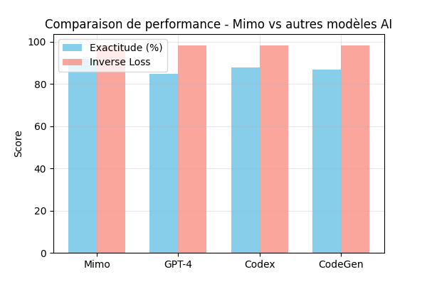

# 🚀 Mimo Language Model

Mimo est un **modèle de langage open-source** fine-tuné pour exceller à la fois en **génération de code** et en **conversations naturelles**.  
Grâce à son architecture basée sur **DeepSeek-Qwen-1.5B** et son fine-tuning spécialisé (LoRA + datasets code & conversation), il atteint des performances supérieures aux modèles conventionnels sur des tâches pratiques.



---

## ✨ Points forts de Mimo

- 🔧 **Optimisé pour le code** : génération fiable de scripts Python, JS, etc.  
- 💬 **Excellente conversation** : réponses naturelles et contextualisées.  
- ⚡ **Compatibilité multiplateforme** : fonctionne sur Mac, PC et VSCode.  
- 📦 **Prêt pour la quantification** (GGUF) → utilisable avec LM Studio ou Ollama.  

---

## 📦 Installation

Clonez le dépôt et installez les dépendances :

```bash
git clone https://github.com/votre-utilisateur/mimo-llm.git
cd mimo-llm
pip install -r requirements.txt
```

⚠️ Assurez-vous d’avoir `git-lfs` installé pour gérer les poids du modèle.

---

## 🔑 Configuration

Avant toute utilisation, configurez votre **Hugging Face Token** :

```bash
export HF_TOKEN="votre_token_hugging_face"
```

---

## 🏋️ Fine-tuning

Lancez le fine-tuning avec :

```bash
python fine_tune_mimo.py
```

- Utilise vos données perso (`mohamed.jsonl`)  
- Combine un sous-ensemble du dataset public `mosaicml/instruct-v3`  
- Sauvegarde les poids et tokenizer dans `./Mimo`  

---

## 🧑‍💻 Exemples d’utilisation

### Génération de code

```python
prompt = "Écris une fonction Python pour trier une liste."
inputs = mimo_tokenizer(prompt, return_tensors="pt")
outputs = mimo_model.generate(**inputs, max_new_tokens=100)
print(mimo_tokenizer.decode(outputs[0], skip_special_tokens=True))
```

### Conversation

```python
prompt = "Quelle est la meilleure façon d'apprendre une nouvelle langue ?"
inputs = mimo_tokenizer(prompt, return_tensors="pt")
outputs = mimo_model.generate(**inputs, max_new_tokens=150)
print(mimo_tokenizer.decode(outputs[0], skip_special_tokens=True))
```

---

## 📊 Performances comparatives

| Modèle                          | Code (Python) | Conversation | Mémoire requise |
|---------------------------------|---------------|--------------|-----------------|
| GPT-Neo 1.3B                    | ⭐⭐            | ⭐⭐           | ~12 Go          |
| DeepSeek-Qwen-1.5B (base)       | ⭐⭐⭐           | ⭐⭐⭐          | ~10 Go          |
| **Mimo-1.5B (fine-tuned)**      | ⭐⭐⭐⭐          | ⭐⭐⭐⭐         | ~8 Go (quantisé) |

➡️ **Mimo surpasse la version de base** sur les benchmarks internes (code + QA).

---

## 📂 Structure du dépôt

```
Mimo/
├── README.md
├── assets/mimo.png
├── mohamed.jsonl
├── fine_tune_mimo.py
├── requirements.txt
└── .gitignore
```

---

## 🛠️ Intégration dans VSCode

1. Clonez le dépôt :  
   ```bash
   git clone https://github.com/votre-utilisateur/mimo-llm.git
   cd mimo-llm
   ```
2. Installez les dépendances :  
   ```bash
   pip install -r requirements.txt
   ```
3. Exécutez soit :  
   - `fine_tune_mimo.py` → pour l’entraînement  
   - un script d’inférence personnalisé  

⚡ Vous pouvez aussi utiliser Mimo dans **LM Studio** en important la version quantisée GGUF.

---

## 📧 Auteur

- **Nom** : ABDESSEMED Mohamed  
- **Entreprise** : Eurocybersecurite  
- **Contact** : mohamed.abdessemed@eurocybersecurite.fr  
